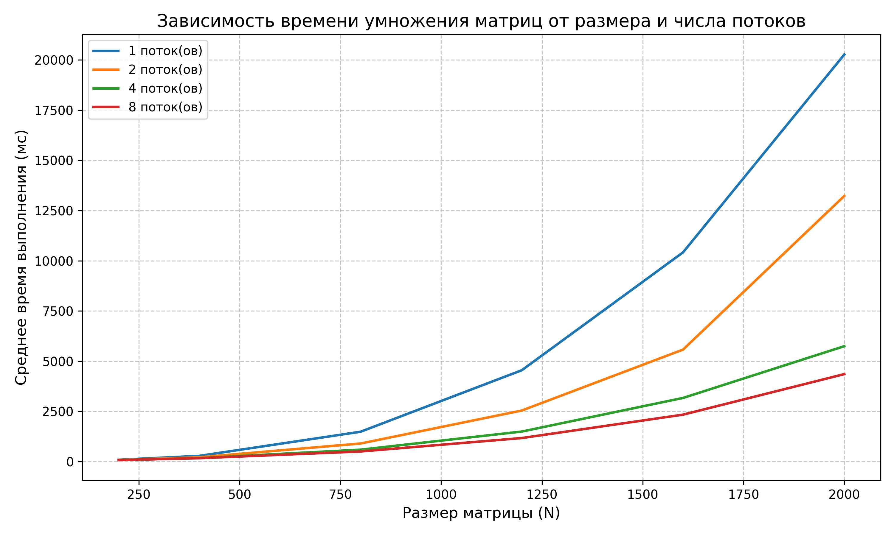

# Лабораторная работа №2  
## Параллельное умножение квадратных матриц с использованием OpenMP

В данной работе реализовано параллельное умножение двух квадратных матриц с использованием технологии OpenMP. Проведены замеры времени выполнения для различных размеров матриц (200, 400, 800, 1200, 1600, 2000) и разного количества потоков (1, 2, 4, 8).

---

## Состав проекта

- **`main.cpp`** – программа на C++ с поддержкой OpenMP. Выполняет умножение матриц, замеряет время выполнения и записывает результат в CSV-файл (имя формируется как `C<потоки>_<размер>.csv`). Поддерживает интерактивный выбор файлов и количества потоков.
- **`graph.py`** – анализирует полученные CSV-файлы, вычисляет среднее время для каждой комбинации (потоки, размер) и строит графики зависимости времени от размера для разного числа потоков, а также таблицу ускорения.
- **`result`** - папка с файлами вида `C<потоки>_<размер>.csv`, в которых записаны 3 результата выполнения операции умножения матриц в формате `размер`, `кол-во потоков`, `время выполнения`

---

## Порядок выполнения работы

1. **Компиляция программы** (с поддержкой OpenMP)  
   Для MSVC (Visual Studio) в командной строке разработчика:  
   ```
   cl /openmp main.cpp /Fe:main.exe
   ```

2. **Выполнение замеров**

   Для каждого размера и количества потоков (1, 2, 4, 8) запустите программу, указав пути к соответствующим файлам матриц(матрицы взяты из предыдущей          лабораторной работы) и имя выходного CSV-файла(например, C1_200.csv). Каждый замер повторите 3 раза для получения среднего значения.
   Пример:
    ```
    main.exe
    Enter number of threads: 4
    Path to matrix A: matrices/A_200.csv
    Path to matrix B: matrices/B_200.csv
    Path to result CSV: C4_200.csv
    ```

6. **Построение графиков и анализ**
Запустите graph.py. Скрипт найдёт все файлы вида C<потоки>_<размер>.csv, вычислит среднее время и построит графики, а также выведет таблицы                 средних значений и ускорения.

---

## Результаты

**Таблица среднего выполнения(мс)**
  | Размер | 1 Поток | 2 потока | 4 потока | 8 потоков |
  |:------:|:-------:|:--------:|:--------:|:---------:|
  |  200   | 67      | 34       | 18       | 13        |
  |  400   | 451     | 238      | 116      | 93        |
  |  800   | 3653    | 1899     | 957      | 699       |
  |  1200  | 12477   | 6395     | 3291     | 2302      |
  |  1600  | 20950   | 15180    | 7848     | 5432      |
  |  2000  | 58887   | 32547    | 15943    | 10652     |

**Таблица ускорения(относительно 1 потока)**
|Размер |   2   |    4  |    8  |
|:-----:|:-----:|:-----:|:-----:|
|200    | 1.97  |3.72   |5.15   |
|400    | 1.89  |3.88   |4.84   |
|800    | 1.92  |3.87   |5.22   |
|1200   | 1.95  |3.79   |5.42   |
|1600   | 1.38  |2.66   |3.85   |
|2000   | 1.81  |3.69   |5.52   |

**График зависимости времени от размера матрицы**


---

## Выводы
1. Эффективность параллелизации – для всех размеров ускорение приближается к линейному (на 4 потоках ~3.7×, на 8 потоках ~5.2×). Неидеальность связана с накладными расходами на создание потоков и ограничением пропускной способности памяти.

2. Во время выполнения работы был замечен особый флаг для оптимизации комилятора - /O2, который существенно ускорял работу программы, но все замеры были проведены без его использования.

3. Полученные результаты соответствуют теоретической оценке: алгоритм умножения матриц имеет сложность O(N³), и распараллеливание внешнего цикла даёт значительный выигрыш при различных N.

---

## Дополнительная информация
- Система, на которой проводились измерения: Windows 11 (x64), AMD Ryzen 5 7640HS (6 ядер / 12 потоков), 16 ГБ ОЗУ, компилятор MSVC 2022.

- Среда разработки: Visual Studio Code + командная строка разработчика.

- Количество потоков ограничено 8 (хотя процессор поддерживает 12 логических ядер).

**Все исходные коды и результаты доступны в репозитории.**


