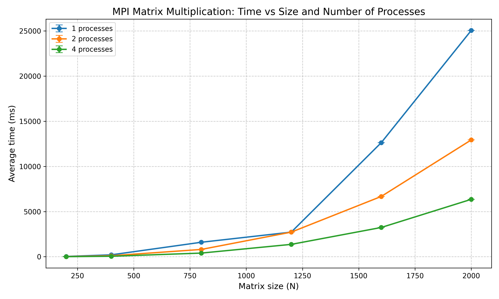

# Лабораторная работа №3  
## Параллельное умножение квадратных матриц с использованием MPI

В данной работе реализовано параллельное умножение двух квадратных матриц с использованием технологии MPI (Message Passing Interface). Проведены замеры времени выполнения для различных размеров матриц (200, 400, 800, 1200, 1600, 2000) и разного количества процессов (1, 2, 4).

---

## Состав проекта

- Матрицы для уможения были взяты из 1 лабораторной
- **`main.cpp`** – MPI-программа. Процесс 0 читает матрицы, рассылает их всем процессам, каждый процесс вычисляет свою часть результирующей матрицы. Время выполнения замеряется с помощью `MPI_Wtime()`.
- **`graphic.py`** – обрабатывает CSV-файлы из папки `result/` (имена вида `result_C<процессы>_<размер>.csv`), строит график зависимости времени от размера для разного числа процессов, вычисляет ускорение.

---

## Порядок выполнения работы

1. **Компиляция MPI-программы** (на Linux)  
   ```bash
   mpicxx -o main main.cpp
   ```

2. **Выполнение замеров**  
   Для каждого размера и каждого количества процессов N (1, 2, 4) запустите:
   ```bash
   mpiexec -n <N> ./matrix_mpi matrices/A_<size>.csv matrices/B_<size>.csv result/result_C<N>_<size>.csv
   ```
   Например, для размера 800 и 4 процессов:
   ```bash
   mpiexec -n 4 ./main matrices/A_800.csv matrices/B_800.csv result/result_C4_800.csv
   ```
   Для получения надёжных средних каждый эксперимент рекомендуется повторить хотя бы 3 раза (создавая отдельные файлы или дописывая строки в тот же файл – скрипт усреднит все значения).

3. **Построение графиков**  
   ```bash
   python graphic.py
   ```
   Будет создан файл `mpi_time_vs_size.png` и выведены таблицы средних значений и ускорения.

---

## Результаты

### Таблица среднего времени выполнения (мс)

| Размер | 1 процесс | 2 процесса | 4 процесса |
|--------|-----------|------------|------------|
| 200    | 29        | 15         | 7          | 
| 400    | 207       | 108        | 51         |
| 800    | 1599      | 805        | 401        |
| 1200   | 2720      | 1432       | 1366       |
| 1600   | 12624     | 6671       | 3237       |
| 2000   | 25048     | 12928      | 6352       |

*Примечание: десятые доли были опущены.*

### Ускорение относительно 1 процесса

| Размер | 2 процесса | 4 процесса |
|--------|------------|------------|
| 200    | 1.93       | 4.04       |
| 400    | 1.92       | 4.07       |
| 800    | 1.99       | 3.99       |
| 1200   | 1.90       | 1.99       |
| 1600   | 1.89       | 3.90       |
| 2000   | 1.94       | 3.94       |

### График зависимости времени от размера матрицы



---

## Вывод

1. MPI демонстрирует хорошее ускорение на всех размерах. Для 2 процессов ускорение достигает ~1.97× Для 4 процессов - ~3.9×. Некоторое снижение эффективности связано с накладными расходами на коммуникацию (рассылка матриц) и несбалансированной загрузкой.

2. Полученные результаты подтверждают теоретическую сложность O(N³) и демонстрируют возможность эффективного распараллеливания задачи умножения матриц в распределённой среде.

---

## Дополнительная информация

- Измерения проводились на виртуальной машине в VirtualBox
- Система, на которой проводились измерения:
- Linux (Xubuntu 24.04), AMD Ryzen 5 7640HS (4 потока), 4 ГБ ОЗУ.
- MPI-реализация: OpenMPI.
- Компилятор: mpicxx (g++).

Среда разработки: терминал Linux.

Количество процессов и количество оперативной памяти ограничено - 4 процесса и 4 ГБ ОЗУ соответственно. Причина состоит в том, что измерения проводились на виртуальной машине, в которой были выставлены данные настройки.

**Все исходные коды и результаты доступны в репозитории.**
