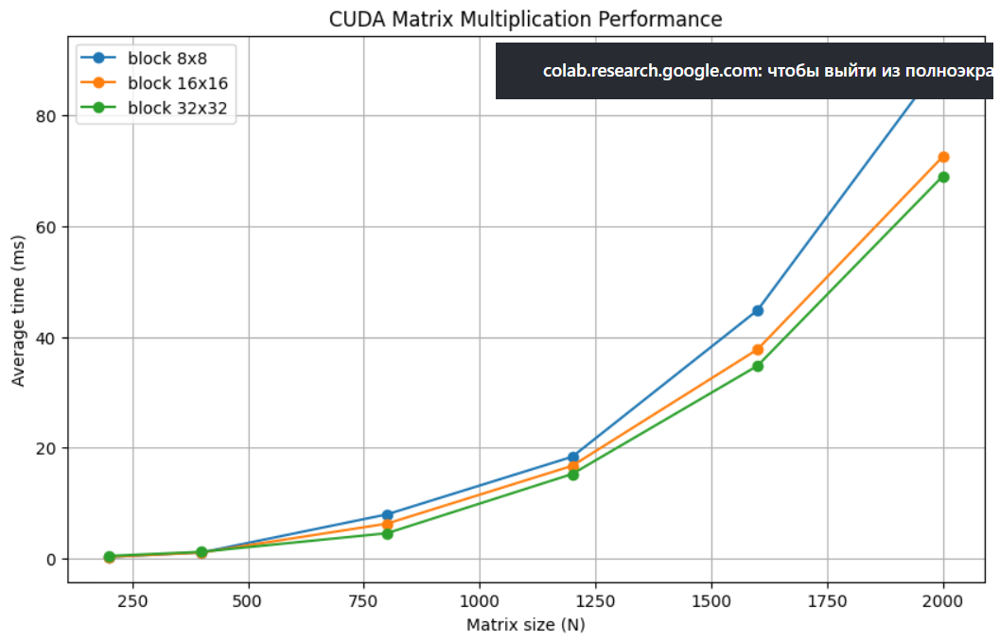

# Лабораторная работа №4  
## Параллельное умножение квадратных матриц с использованием CUDA

В данной работе реализовано параллельное умножение двух квадратных матриц с использованием технологии CUDA (Compute Unified Device Architecture) на графическом процессоре NVIDIA. Проведены замеры времени выполнения для различных размеров матриц (200, 400, 800, 1200, 1600, 2000) и различных конфигураций блоков потоков (8×8, 16×16, 32×32). Каждый эксперимент повторялся 10 раз, в таблице приведены средние значения времени выполнения (в миллисекундах).

---

## Состав проекта

- **`main.cu`** – CUDA-программа, выполняющая умножение матриц на GPU. Программа автоматически тестирует все указанные размеры и конфигурации блоков, выполняет 10 замеров для каждой комбинации и записывает среднее время в CSV-файл.  
- **`graphic.py`** – считывает полученный CSV-файл и строит график зависимости времени от размера матрицы для разных конфигураций блоков.

---

## Порядок выполнения работы

1. **Генерация матриц**
   *В данной реализации матрицы генерируются непосредственно в CUDA-коде, поэтому этот шаг можно пропустить.*

3. **Компиляция и запуск CUDA-программы**  
   В среде Google Colab с включённым GPU (или на локальной машине с NVIDIA) выполняется код, содержащий:
   - Компиляцию с `nvcc`
   - Запуск тестов для всех размеров и конфигураций блоков
   - Сохранение результатов в `cuda_benchmark.csv`

4. **Построение графиков**  
   Запуск Python-скрипта для визуализации:

---

## Результаты

### Таблица среднего времени выполнения (мс)

| Размер матрицы | Блок 8×8 | Блок 16×16 | Блок 32×32 |
|----------------|----------|------------|------------|
| 200            | 0.19     | 0.21       | 0.38       |
| 400            | 1.01     | 0.99       | 1.13       |
| 800            | 7.89     | 6.22       | 4.49       |
| 1200           | 18.31    | 16.68      | 15.20      |
| 1600           | 44.81    | 37.73      | 34.77      |
| 2000           | 89.97    | 72.59      | 69.07      |

*Примечание: значения округлены до сотых; каждый результат – среднее из 10 измерений.*

### График зависимости времени от размера матрицы

---

## Вывод

1. Влияние конфигурации блоков – для небольших матриц (200, 400) разница между размерами блоков незначительна, а для больших матриц (≥800) блоки 32×32 показывают наилучшую производительность. Это объясняется лучшим использованием ресурсов GPU (больше потоков на блок).

2. Сравнение с CPU – время выполнения на GPU для матрицы 2000×2000 составляет около 70–90 мс, что в сотни раз быстрее, чем на одном ядре CPU (десятки секунд без оптимизации).

3. Масштабируемость – сложность алгоритма O(N³) сохраняется, но благодаря тысячам потоков GPU время растёт медленнее, чем на CPU (при N=2000 время ~70 мс).

4. Рекомендация – для максимальной производительности на матрицах размером от 800×800 следует использовать блоки 32×32. Для мелких матриц подойдёт любой размер блока.

---

## Дополнительная информация

- Система, на которой проводились измерения:
  Google Colab (NVIDIA Tesla T4, 16 ГБ видеопамяти, 2560 ядер CUDA).
- Компилятор: nvcc (CUDA 11.8).
- Хост-система: Ubuntu 20.04 (виртуальная среда Colab).

- Количество повторений: 10 для каждой комбинации (размер, конфигурация блоков).

- График построен с использованием matplotlib.

**Все исходные коды и результаты доступны в репозитории.**

