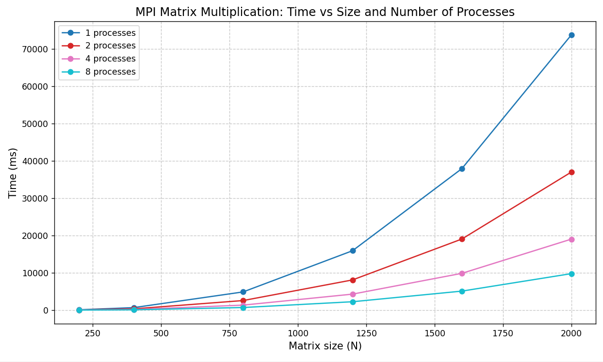

# Лабораторная работа №5  
## Параллельное умножение квадратных матриц с использованием MPI (суперкомпьютер)

В данной работе реализовано параллельное умножение двух квадратных матриц с использованием технологии MPI. Программа генерирует две квадратные матрицы заданного размера со случайными целыми числами от 0 до 1000 и перемножает их в параллельном режиме. Проведены замеры времени выполнения для размеров 200, 400, 800, 1200, 1600, 2000 и числа процессов 1, 2, 4, 8. Для каждого сочетания выполнено 3 запуска, в таблицах приведены средние значения времени (в миллисекундах).

---

## Состав проекта

- **`lab5.cpp`** – MPI-программа. Принимает размер матрицы как аргумент командной строки, генерирует матрицы на процессе 0, рассылает их всем процессам, выполняет параллельное умножение (построчное распределение), замеряет время с помощью `MPI_Wtime()` и дописывает результат в CSV-файл.
- **`graphic.py`** – скрипт на Python для обработки результатов: вычисление средних и стандартных отклонений, построение графика зависимости времени от размера матрицы для разного числа процессов, расчёт ускорения.
- **`results.csv`** – файл с результатами всех запусков (3 замера для каждой комбинации).

---

## Порядок выполнения работы

1. **Компиляция программы** на суперкомпьютере с использованием Intel MPI:
   ```bash
   mpicxx -o lab5 lab5.cpp
   ```
2. **Запуск с разным числом процессов и размерами** (через PBS-скрипт):
3. **Сбор результатов** в файл `results.csv`.
4. **Обработка данных и построение графика**:  

---

## Результаты

### Таблица среднего времени выполнения (мс)

| Размер | 1 процесс | 2 процесса | 4 процесса | 8 процессов |
|--------|-----------|------------|------------|--------------|
| 200    | 83.60     | 42.51      | 21.68      | 10.90        |
| 400    | 657.40    | 329.31     | 166.27     | 82.81        |
| 800    | 4868.78   | 2554.32    | 1330.61    | 685.96       |
| 1200   | 15905.03  | 8084.09    | 4275.91    | 2236.73      |
| 1600   | 37918.00  | 19046.17   | 9849.64    | 5085.85      |
| 2000   | 73732.73  | 36985.33   | 19013.30   | 9766.89      |

### Ускорение относительно 1 процесса

| Размер | 2 процесса | 4 процесса | 8 процессов |
|--------|------------|------------|--------------|
| 200    | 1.97       | 3.86       | 7.67         |
| 400    | 2.00       | 3.95       | 7.94         |
| 800    | 1.91       | 3.66       | 7.10         |
| 1200   | 1.97       | 3.72       | 7.11         |
| 1600   | 1.99       | 3.85       | 7.46         |
| 2000   | 1.99       | 3.88       | 7.55         |

### График зависимости времени от размера матрицы



---

## Вывод

- MPI-реализация демонстрирует ускорение на всех размерах и это ускорение растет показательно. Для 8 процессов ускорение составляет 7–8 раз, что близко к идеальному (8) с учётом накладных расходов на коммуникацию.
- Для маленьких матриц (200) доля коммуникационных затрат выше, но ускорение всё ещё остаётся хорошим.
- Полученные результаты подтверждают теоретическую сложность O(N³) и эффективность параллелизации на распределённой памяти.

---

## Дополнительная информация

- Суперкомпьютер: кластер с Intel MPI 4, компилятор Intel C++.

- Измерения: каждый эксперимент повторён 3 раза, указаны средние значения.

- График построен с помощью matplotlib и сохранён в формате PNG.

**Все файлы (исходный код, скрипт обработки, результаты, график) доступны в репозитории.**
